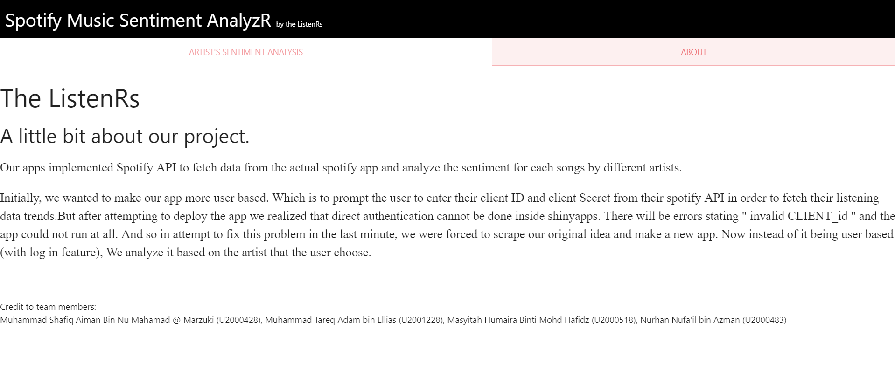
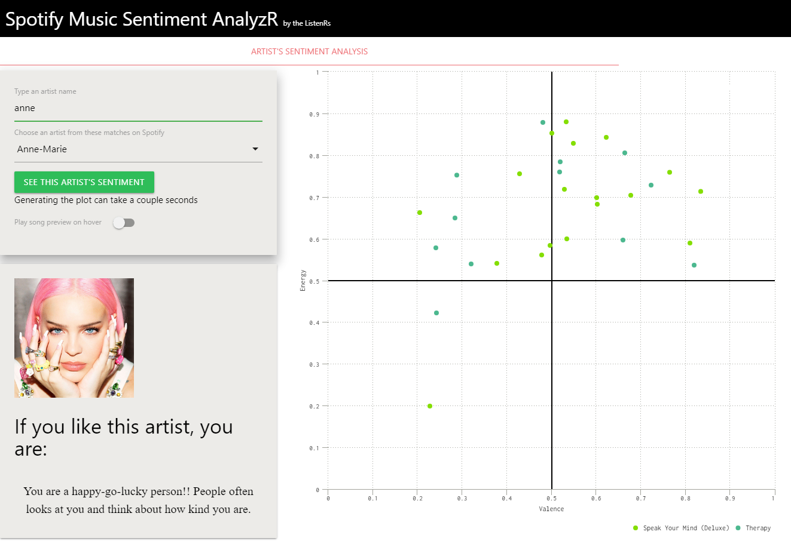
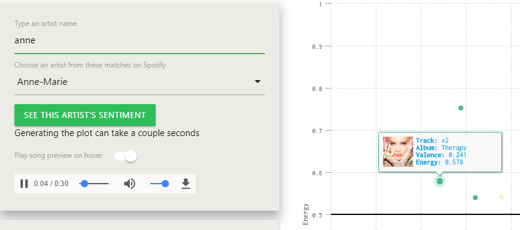

Spotify Music Sentiment Analyzer
========================================================
left: 50%
WIA1007 Intro to Data Science ( Group P )
#### The ListenR’s

27 January 2022

Group Members: 
- Muhammad Shafiq Aiman (U2000428) 
- Nurhan Nufa'il (U2000483)
- Muhammad Tareq Adam (U2001228)
- Masyitah Humaira (U2000518)

***

Project Introduction
========================================================
</style>
# This presentation reports the Shiny Application and Reproducible Pitch Group Project of the __Intro to Data Science Course WIA1007__

# The Shiny app is built entirely in R, and the analysis is made based on the artist inputted by the user.

# **Aim of the project** :
# Create a platform for the user to :
- Analyze their personality
- Analyze the sentiment of each artist

***

# **Questions** :

- What does a person's music taste have in correlation with their personality?
- Which sentiment is most presented among music artists?

# **Project's Stakeholder** :

+ Music Lovers
+ Songwriter
+ Music Producer

Dataset Description
========================================================
</style>
- The Spotify API is used to retrieve data.
- Data is processed by extracting only the relevant features.
- We visualize our data using a chart (the chart is interactive).
- We extract data from Spotify API and use that data.
- The data that we extract:
	- Artists, tracks, albums
	- The artists' sentiment type and their scores ( Positivity/Valence, Energy )
	- The artists' image and track audio

# **Data Acquisition**

# We searched for datasets online and found the best dataset for our project from the Spotify API.

# **Data Analysis**

# We analyse the user's personality through their selected artist, which is determined by the sentiment of each song by the artist.

App Description
========================================================
left: 35%
</style>

The app starts with an empty input. To start this app, users are required to input the artist's name.

The app consist of two panel  : __About__ & __Sentiment Analysis__

**About** :  This panel will show a little description about the project.
  
**Sentiment Analysis** : This panel will display three parts : *Input* , *Plot* & *User's overall sentiment*

*Input* : This is for the user to input the artist's name that matches on Spotify. The user can also choose if they want to play the song preview on hover.

*Plot* : This panel will allow the user to see the sentiment of each song for the specific artist. The sentiment is based on the audio features set by Spotify. This panel will also list out the album of the songs displayed. 

***

*User's overall sentiment*:

This panel will display the artist's image based on the display picture on the artist's Spotify page. Then the program will display the user's music sentiments or music personality by comparing the score of the specific features for each of the artist's songs ( Positivity/Valence vs Energy )

Experience using this app
========================================================
# The app fully utilises and analyses the user's selected artist's music sentiment accurately and was able to give insights into the type of personality of the user.
# The overall experience of completing this data science project was fun and challenging. Although some problems arise (which are explained in the __About__ panel) right when we have already finished the app, we are able to properly take care of them. Overall, we planned the program and divided the tasks for the project quite well, so we managed to finish it on time.

**Here is the link to our project:**
- [Github Link](https://github.com/shafiqps/Spotify-Dashboard.git)
- [Spotify Music Sentiment Analyzer Link](https://shfqaimann.shinyapps.io/spotifysentimentanalyzr/)

## Thank you for your time.

