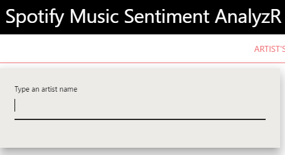
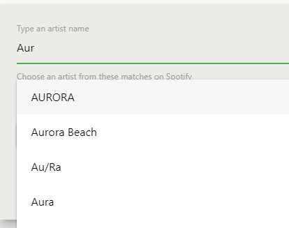
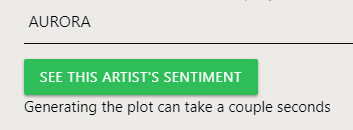
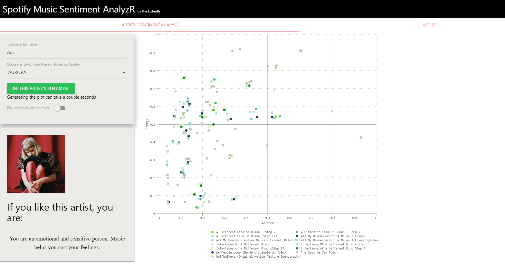

Spotify Music Sentiment Analyzer
========================================================
left: 50%
WIA1007 Intro to Data Science ( Group P )
#### The ListenR’s

27 January 2022

Group Members: 
- Muhammad Shafiq Aiman (U2000428) 
- Nurhan Nufa'il (U2000483)
- Muhammad Tareq Adam (U2001228)
- Masyitah Humaira (U2000518)

***

Project Introduction
========================================================
</style>
# This presentation reports the Shiny Application and Reproducible Pitch Group Project of the __Intro to Data Science Course WIA1007__

# The Shiny app is built entirely in R, and the analysis is made based on data from Spotify API

# **Aim of the project** :
# Create a platform for the user to :
- Analyze their favorite artist music sentiment
- Find out what their favourite artist hint about their personality

***

# **Questions** :

- What does a person's music taste have in correlation with their personality?
- Which sentiment is most presented among music artists?
- What is the trend of music sentiment among artists nowadays?

# **Project's Stakeholder** :

+ Music Lovers
+ Songwriter
+ Music Producer

Dataset Description
========================================================
</style>
- The [Spotify API](https://developer.spotify.com/) is used to fetch the required data. **(Data acquisition)**
- Data is **processed** by extracting only the relevant features—mainly valence and energy sentiment.
- The data that we extract:
	- Artists, tracks, albums, valence score, energy score.
	- We are using the search_spotify() function to fetch data for a specific artist. In other words our dataset is dynamic depending on the artist that the user input.
	
# **Data Analysis**

# After a user input their chosen artist, the app will fetch all relevant data (tracks,albums,valence,energy) and determine the sentiment's spectrum in the sentiment quadrant (will see more clearly in the chart).

# **Data Visualization**

# The app will output a chart plotting the chosen artist's tracks in accordance with the sentiment they invoke.

App Description
========================================================
left: 35%
</style>

**Artist's Sentiment Analysis** :  This is the main tab.
 
  
The app starts with an empty input. Users are required to input some keyword (artist name) in the text input.

After typing a few keyword, some suggestion will come up and you can choose your artist from the dropdown input.

The **About** tab is to provide additional information about our app.

***

After choosing your artist, you can click "SEE THIS ARTIST"S SENTIMENT"
button to generate the artist's sentiment chart.

It will take a couple seconds, and this is how it will look after being generated.

Your chosen artist's image will pop up as well as a general text stating what your personality might be according to what the app analyzes.

Experience using this app
========================================================
# The app fully utilises and analyses the chosen artist's data from Spotify API and is able to give insights to the type of music the artist makes, along with the user general music personality.

**Some problems we encounter**
Our main problem is easily regarding the Spotify API authentication system. This problem caused us to reconsider our initial app(a user-based app—where the user log in to their Spotify API themselves to see their personal data). Although our initial app works locally, a problem arise when we could not deploy it successfully on shinyapps.io. So we come to the solution to NOT make our app user-based, basically starting our app from scratch. And thankfully here is the result!!
  
The overall experience of completing this data science project was very challenging. Although some problems arise (which are explained in the __About__ panel) right when we have already finished the app, we are able to properly take care of them. Overall, we learned a lot by doing this project, both in data science knowledge and tin team works.

**Here is the link to our project:**
- [Github Link](https://github.com/shafiqps/Spotify-Dashboard.git)
- [Spotify Music Sentiment Analyzer Link](https://shfqaimann.shinyapps.io/spotifysentimentanalyzr/)

## Thank you for your time.

